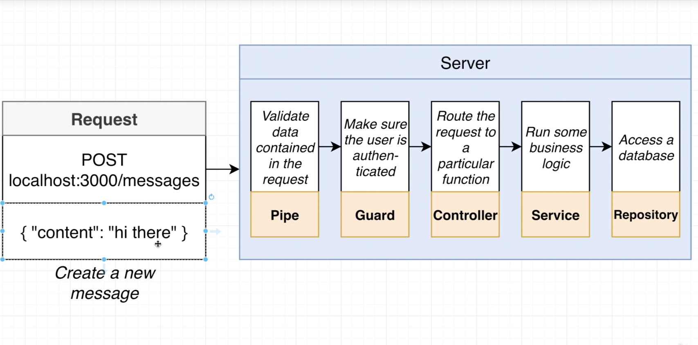
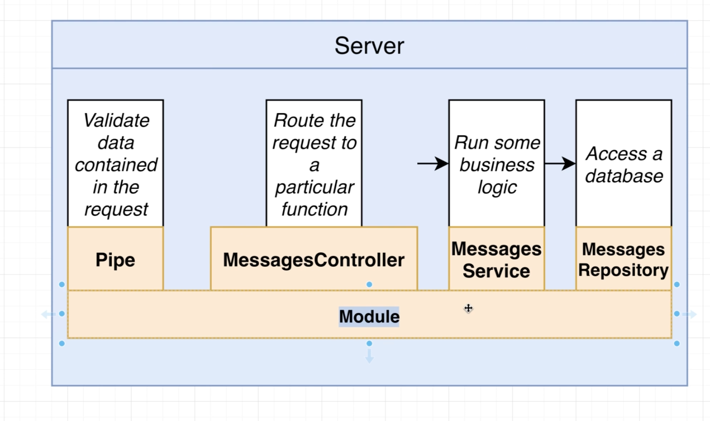
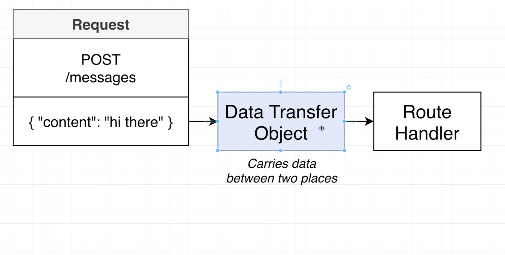
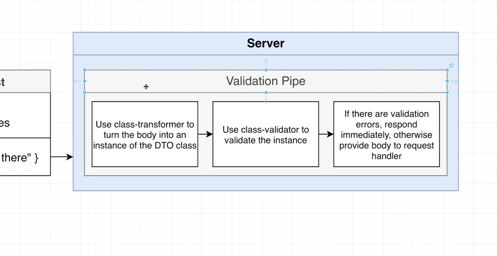
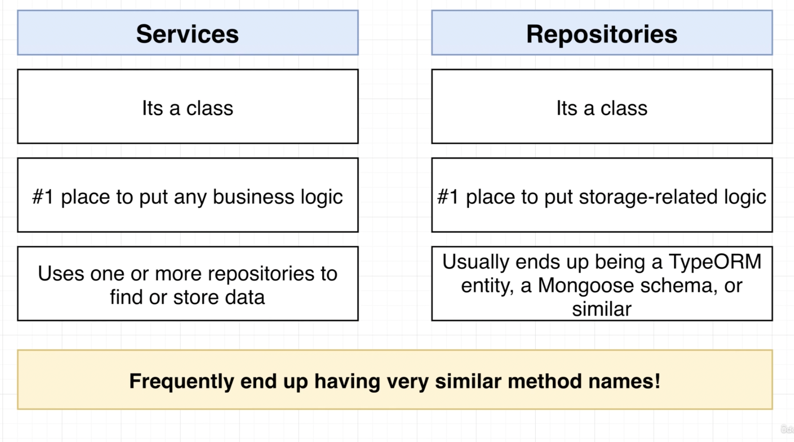
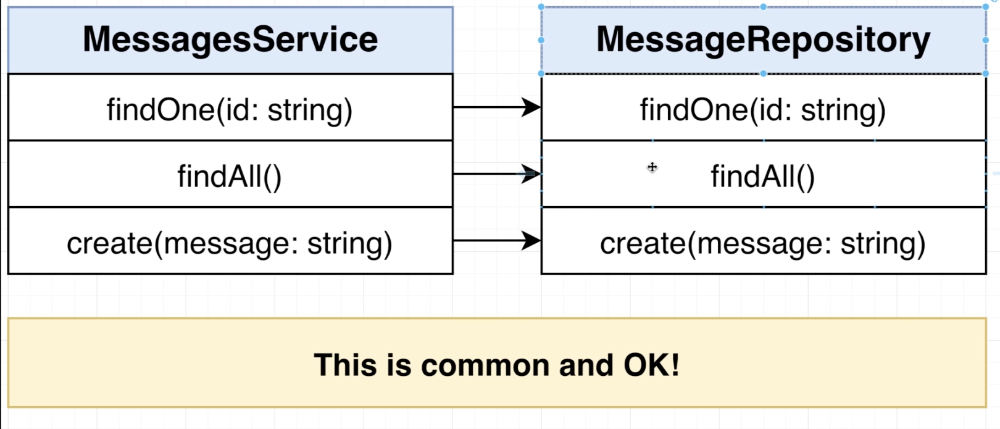
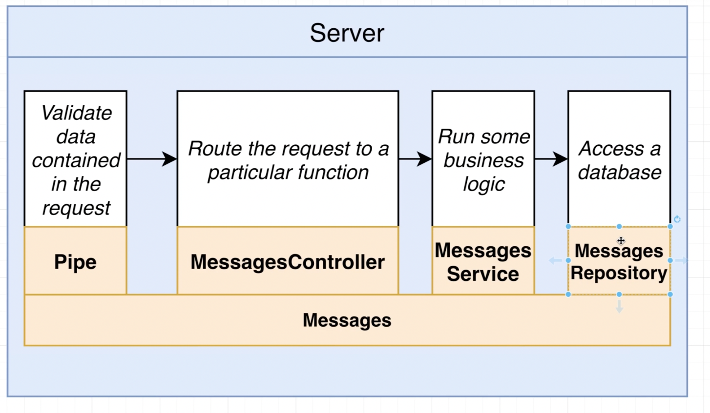
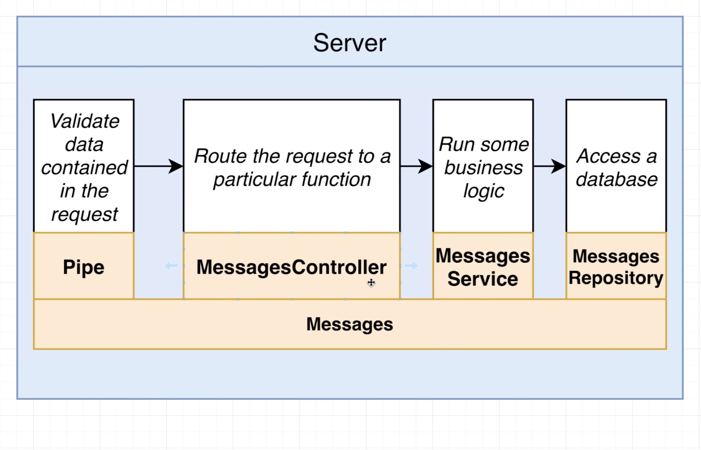
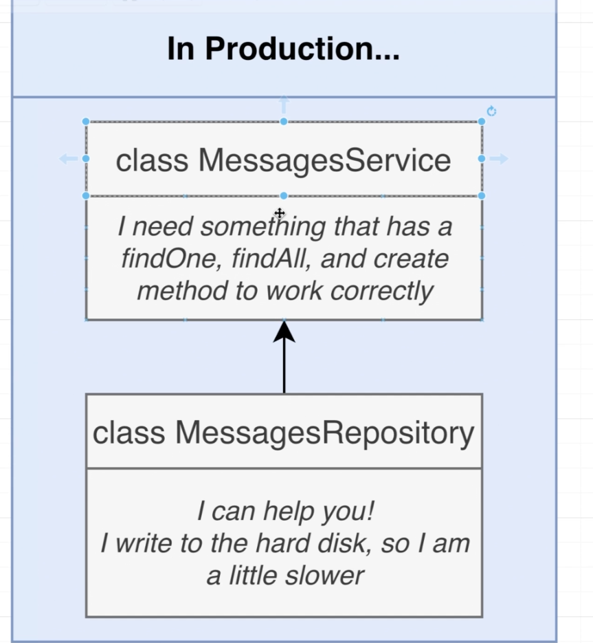
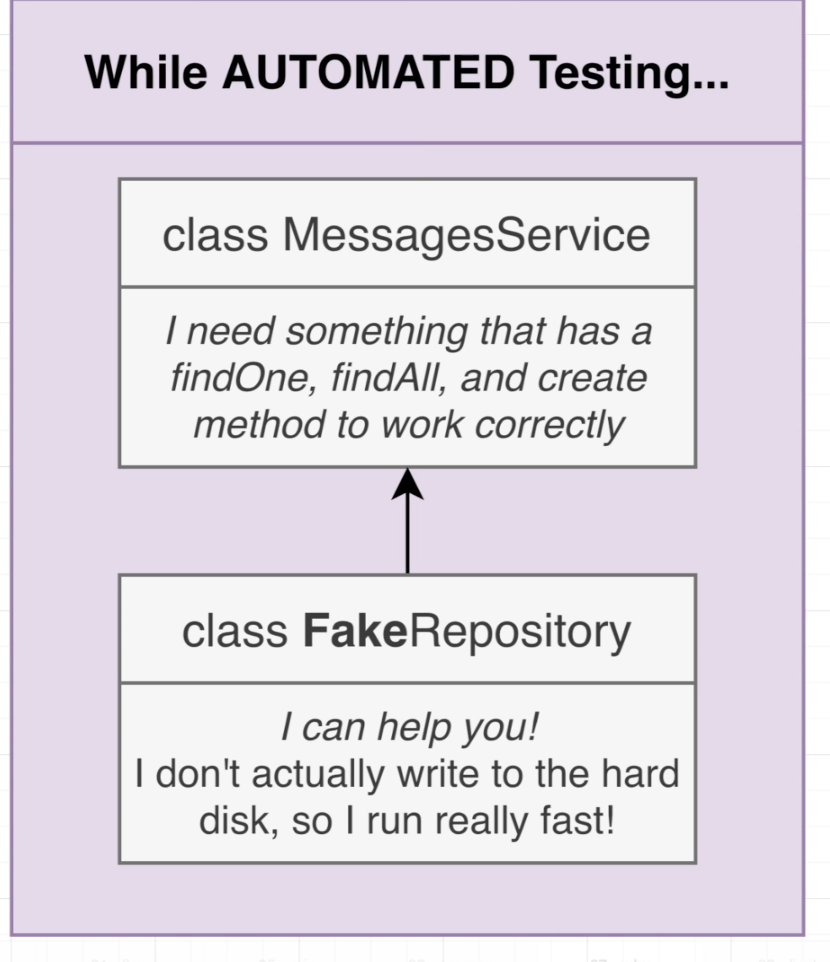

# NEST CLI

### install nestjs cli

```bash
sudo npm install -g @nestjs/cli
```

### create project

```bash
nest new {project}
```

### nest generate

```bash
nest generate module {module_name}
```

```bash
nest generate controller {controller_name} --flat
nest generate controller mesasges/messages --flat
```

- `--flat` : Don’t create an extra folder called ‘controllers’

# Project Setup

### How NestJS works



### Our app’s structure



### NestJS Typical Pipelines

- Pipe ⇒ Validate data contained in the request
- Guard ⇒ Make sure the user is authenticated
- Controller ⇒ Route the request to a particular function
- Service ⇒ Run some business Logic
- Repository ⇒ Access a database

### start dev

```bash
npm run start:dev
```

### eslintrc.js

```jsx
module.exports = {
  parser: '@typescript-eslint/parser',
  parserOptions: {
    project: 'tsconfig.json',
    sourceType: 'module',
  },
  plugins: ['@typescript-eslint/eslint-plugin'],
  extends: [
    'plugin:@typescript-eslint/recommended',
    'plugin:prettier/recommended',
  ],
  root: true,
  env: {
    node: true,
    jest: true,
  },
  ignorePatterns: ['.eslintrc.js'],
  rules: {
    '@typescript-eslint/interface-name-prefix': 'off',
    '@typescript-eslint/explicit-function-return-type': 'off',
    '@typescript-eslint/explicit-module-boundary-types': 'off',
    '@typescript-eslint/no-explicit-any': 'off',
  },
};
```

⇒ catch errors

⇒ recommend to disable eslintrc (comment out)

# Setting Up Automatic Validation

### Process

1. Tell Nest to use global validation
2. Create a class that describes the different properties that the request body should have
   1. Data Transfer Object. DTO.
3. Add validation rules to the class
4. Apply that class to the request handler

### 1. Tell Nest to use global validation

```tsx
import { NestFactory } from '@nestjs/core';
import { ValidationPipe } from '@nestjs/common';
import { MessagesModule } from './messages/messages.module';

async function bootstrap() {
  const app = await NestFactory.create(MessagesModule);
  // Install Global Pipes
  app.useGlobalPipes(new ValidationPipe());
  await app.listen(3000);
}
bootstrap();
```

### 2. Create a class that describes the different properties that the request body should have & 3. Add validation rule to the class

```bash
npm install class-validation class-transformer
```

- /messages/dtos/create-message.dto.ts

```tsx
import { IsString } from 'class-validator';

export class CreateMessageDto {
  @IsString()
  content: string;
}
```

### 4. Apply that class to the request handler

```tsx
// This file is created `nest generate controller messages/messages`
import { Body, Controller, Get, Param, Post } from '@nestjs/common';
import { CreateMessageDto } from './dtos/create-message.dto';

@Controller('messages')
export class MessagesController {
  @Get()
  listMessages() {}

  @Post()
  createMessage(@Body() body: CreateMessageDto) {
    console.log(body);
  }

  @Get('/:id')
  getMessage(@Param('id') id: string) {
    console.log(id);
  }
}
```

### Conclusion

- This entire process enforces request to accept when property name is `content` and its type is `string` . Otherwise, it will throw an error response.
- Error Response

```json
{
  "statusCode": 400,
  "message": ["content must be a string"],
  "error": "Bad Request"
}
```

# How Validation works?

### What is DTO?

- Carries data between two places.



### About Class Transformer Package

- Takes a plain object and transforms it into class

### Diagram

1. Use class-transformer to turn the body into an instance of the DTO class
2. Use class-validator to validate the instance
3. If there are validation errors, respond immediately, otherwise provide body to request handler



# Services and Repositories

### Service & Repositories Diagram



### Almost Same Method Name!



### Our App Structure



### What is Services?

- Its a class
- #1 place to put any business logic
- Uses one or more repositories to find or store data

### Repositories

- Its a class
- #1 place to put storage-related logic
- Usually ends up being a TypeORM entity, a Mongoose schema, or similar

# Implementing Repository & Service

### messages.repository.ts

```tsx
import { readFile, writeFile } from 'fs/promises';

export class MessagesRepository {
  async findOne(id: string) {
    const contents = await readFile('messages.json', 'utf8');
    const messages = JSON.parse(contents);
    return messages[id];
  }

  async findAll() {
    const contents = await readFile('messages.json', 'utf8');
    const messages = JSON.parse(contents);
    return messages;
  }

  async create(content: string) {
    const contents = await readFile('messages.json', 'utf8');
    const messages = JSON.parse(contents);
    const id = Math.floor(Math.random() * 999);
    messages[id] = { id, content };
    await writeFile('messages.json', JSON.stringify(messages));
  }
}
```

### messages.service.ts

```tsx
import { MessagesRepository } from './messages.repository';

export class MessagesService {
  messagesRepo: MessagesRepository;

  constructor() {
    // Service is creating its own dependencies
    // DONT DO THIS ON REAL APPS
    this.messagesRepo = new MessagesRepository();
  }

  findOne(id: string) {
    return this.messagesRepo.findOne(id);
  }

  findAll() {
    return this.messagesRepo.findAll();
  }

  create(content: string) {
    return this.messagesRepo.create(content);
  }
}
```

### messages.controller.ts

```tsx
// This file is created `nest generate controller messages/messages`
import { Body, Controller, Get, Param, Post } from '@nestjs/common';
import { CreateMessageDto } from './dtos/create-message.dto';
import { MessagesService } from './messages.service';

@Controller('messages')
export class MessagesController {
  messagesService: MessagesService;

  constructor() {
    // DONT DO THIS ON REAL APP
    // USE DEPENDENCY INJECTION
    this.messagesService = new MessagesService();
  }

  @Get()
  listMessages() {
    return this.messagesService.findAll();
  }

  @Post()
  createMessage(@Body() body: CreateMessageDto) {
    return this.messagesService.create(body.content);
  }

  @Get('/:id')
  getMessage(@Param('id') id: string) {
    return this.messagesService.findOne(id);
  }
}
```

# Error Handling

```tsx
  @Get('/:id')
  async getMessage(@Param('id') id: string) {
    const message = await this.messagesService.findOne(id);
    if (!message) {
      throw new NotFoundException('Message Not Found');
    }
    return message;
  }
```

```tsx
// This file is created `nest generate controller messages/messages`
import {
  Body,
  Controller,
  Get,
  Param,
  Post,
  NotFoundException,
} from '@nestjs/common';
import { CreateMessageDto } from './dtos/create-message.dto';
import { MessagesService } from './messages.service';

@Controller('messages')
export class MessagesController {
  messagesService: MessagesService;

  constructor() {
    // DONT DO THIS ON REAL APP
    // USE DEPENDENCY INJECTION
    this.messagesService = new MessagesService();
  }

  @Get()
  listMessages() {
    return this.messagesService.findAll();
  }

  @Post()
  createMessage(@Body() body: CreateMessageDto) {
    return this.messagesService.create(body.content);
  }

  @Get('/:id')
  async getMessage(@Param('id') id: string) {
    const message = await this.messagesService.findOne(id);
    if (!message) {
      throw new NotFoundException('Message Not Found');
    }
    return message;
  }
}
```

# Dependency Injection

### Diagram - How our service works now



### Inversion of Control Principle

- **Classes should not create instances of its dependencies on its own.**

### Bad

- MessagesService creates its own copy of MessagesRepository

```tsx
export class MessagesService {
  messagesRepo: MessagesRepository;
  constructor() {
    this.messagesRepo = new MessagesRepository();
  }
}
```

### Better

- MessagesService receives its dependency

```tsx
export class MessagesService {
  messagesRepo: MessagesRepository;

  constructor(repo: MessagesRepository) {
    this.messagesRepo = repo;
  }
}
```

### Best

- MessagesService receives its dependency, and it doesn’t specifically require ‘’MessagesRepository”

```tsx
interface Repository {
  findOne(id: string);
  findAll();
  create(content: string);
}

export class MessagesSercice {
  messagesRepo: Repository;

  constructor(repo: Repository) {
    this.messagesRepo = repo;
  }
}
```

### Why this?





# DI Container Flow

1. At startup, register all classes with the container
2. Container will figure out what each dependency each class has
3. We then ask the container to create an instance of a class for us
4. Container creates all required dependencies and gives us the instance
5. Container will hold onto the create dependency instances and reuse them if needed

# DI Applied

### messages.repository.ts

```tsx
import { Injectable } from '@nestjs/common';
import { readFile, writeFile } from 'fs/promises';

// Register Dependency
@Injectable()
export class MessagesRepository {
  async findOne(id: string) {
    const contents = await readFile('messages.json', 'utf8');
    const messages = JSON.parse(contents);
    return messages[id];
  }

  async findAll() {
    const contents = await readFile('messages.json', 'utf8');
    const messages = JSON.parse(contents);
    return messages;
  }

  async create(content: string) {
    const contents = await readFile('messages.json', 'utf8');
    const messages = JSON.parse(contents);
    const id = Math.floor(Math.random() * 999);
    messages[id] = { id, content };
    await writeFile('messages.json', JSON.stringify(messages));
  }
}
```

### messages.service.ts

```tsx
import { Injectable } from '@nestjs/common';
import { MessagesRepository } from './messages.repository';

// Register Dependency
@Injectable()
export class MessagesService {
  constructor(public messagesRepo: MessagesRepository) {}

  findOne(id: string) {
    return this.messagesRepo.findOne(id);
  }

  findAll() {
    return this.messagesRepo.findAll();
  }

  create(content: string) {
    return this.messagesRepo.create(content);
  }
}
```

### messages.controller.ts

```tsx
// This file is created `nest generate controller messages/messages`
import {
  Body,
  Controller,
  Get,
  Param,
  Post,
  NotFoundException,
} from '@nestjs/common';
import { CreateMessageDto } from './dtos/create-message.dto';
import { MessagesService } from './messages.service';

@Controller('messages')
export class MessagesController {
  constructor(public messagesService: MessagesService) {}

  @Get()
  listMessages() {
    return this.messagesService.findAll();
  }

  @Post()
  createMessage(@Body() body: CreateMessageDto) {
    return this.messagesService.create(body.content);
  }

  @Get('/:id')
  async getMessage(@Param('id') id: string) {
    const message = await this.messagesService.findOne(id);
    if (!message) {
      throw new NotFoundException('Message Not Found');
    }
    return message;
  }
}
```

### messages.module.ts

```tsx
// This file is created `nest generate moudle messages`
import { Module } from '@nestjs/common';
import { MessagesController } from './messages.controller';
import { MessagesService } from './messages.service';
import { MessagesRepository } from './messages.repository';

@Module({
  controllers: [MessagesController],
  providers: [MessagesService, MessagesRepository],
})
export class MessagesModule {}
```

# Few More Notes on DI

```tsx
// This file is created `nest generate controller messages/messages`
import {
  Body,
  Controller,
  Get,
  Param,
  Post,
  NotFoundException,
} from '@nestjs/common';
import { CreateMessageDto } from './dtos/create-message.dto';
import { MessagesService } from './messages.service';

@Controller('messages')
export class MessagesController {
  constructor(
    public messagesService: MessagesService,
    public messagesService2: MessagesService,
    public messagesService3: MessagesService,
  ) {
    console.log(messagesService === messagesService2);
    console.log(messagesService === messagesService3);
  }

  @Get()
  listMessages() {
    return this.messagesService.findAll();
  }

  @Post()
  createMessage(@Body() body: CreateMessageDto) {
    return this.messagesService.create(body.content);
  }

  @Get('/:id')
  async getMessage(@Param('id') id: string) {
    const message = await this.messagesService.findOne(id);
    if (!message) {
      throw new NotFoundException('Message Not Found');
    }
    return message;
  }
}
```

```tsx
  constructor(
    public messagesService: MessagesService,
    public messagesService2: MessagesService,
    public messagesService3: MessagesService,
  ) {
    console.log(messagesService === messagesService2);
    console.log(messagesService === messagesService3);
  }

```

⇒ What do you think it logs?

⇒ all outputs are true, which means dependency injection happens with single instantiation of an object.
